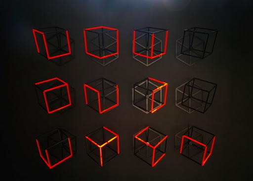

# Modular Typography —

In the seminar, went through some examples of modular typography, so that we could gain some understanding the basic unit of words. Since we were focusing on words and language, this was essential to our understanding that letterforms are built from shapes, in the same way that digital technology is built from code and numbers. Later, we collectively searched for examples of modular typography and gathered them into a google slide.

It was funny that I found it so difficult to find ones not already mentioned in the seminar, but I did end up finding **David Pidgeon**, of Melbourne based studio Pidgeon Ward. His signage for the Venice Architecture Biennale used a cube framework, inspired by US Artist Sol leWitt, who originally created the incomplete open cube experiments.

David Pidgeon's signage for the Venice Architecture Biennale.

Sol LeWitt's Incomplete Open Cubes.

### Some more cooool modular typographers —

- Philippe Apeloig
- Theo Van Doesburg
- Herbert Bayer
- Takenobu Igarashi
- Ahn Sang Soo
- Muir McNeil
- Catherine Zask

# Initials

We all shared our sketches and code of our initials that we worked on during the week, and I was a little intimidated by the amazing work I was seeing, not gonna lie. But thus began some incredible collaboration and direct learning through seeing what others did! 

I feel like life can often seem like a game of hiding your best ideas and resources so no one can steal them, but this was a beautifully porous and generous activity that I'll be returning to once in a while for inspiration and learning. Side note: Learning about github also gave me some wonderful insight, seeing that pull requests were a main feature/function, and sharing code was a given. It seems that the coding community acknowledges society's need for each other in order to move forward, and operates upon this belief more than many other communities.

When we were told to 'hack' someone else's code, I tried to change something small in Sam's sketch - just some more 'mouse variable' stuff as I haven't learnt much more than that yet. It was also awesome to see Tayla use my code to create letters for herself too!

Me hacking Sam's code.

 
Tayla hacking my code.

# Second Life —

Our little second life group was born in week 1, and we'd already had played around a bit to get used to the platform and controls. Exploring camera controls, avatar options and locations. Second life is a bizarre and almost limitless place.

###  [<< WEEK 01](https://jackieliiu.github.io/CODEWORDS/Week01/) | [WEEK 03 >>](https://jackieliiu.github.io/CODEWORDS/Week03/)
