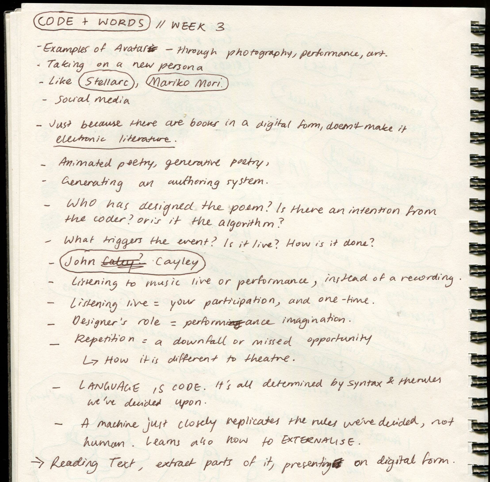
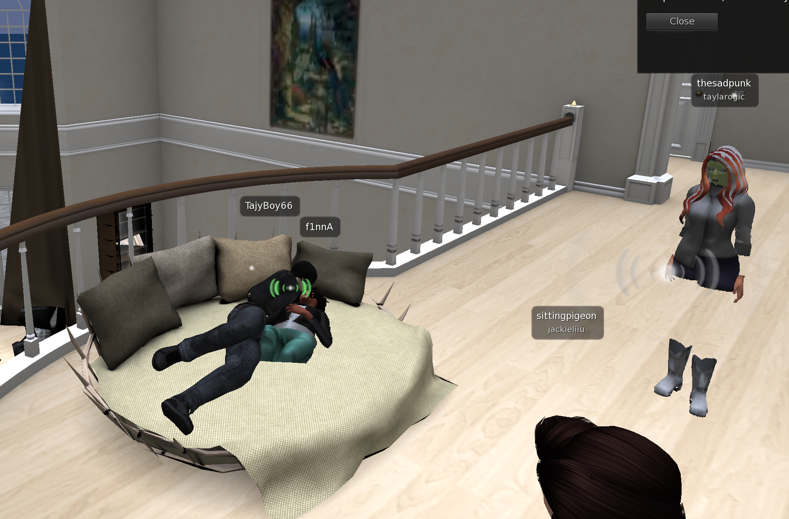

# Week 3 — Electronic Literature
Avatars and visual identities. We were introduced to artists such as Stelarc and Mariko Mori, and gathered more research of e-lit examples. The discoveries made in this session were very unsettling yet highly fascinating (e.g, AI dungeon).

### Notes —

## My own explorations —

I went down a bit of a rabbit hole surrounding e-literature, including e-poetry and AI storytelling. I found the e-poet Jim Andrews, and exploring his [website](http://vispo.com/) was truly an interactive, amusing, and immersive adventure. I also skimmed some of his [essays](http://vispo.com/writings/index.htm#Ssays), and came across this quote from *Me and Kinetic Poetry* that really helped me grasp a major reason for why the world is seeking new, mixed forms of literacy. 

>We read differently now in that we are multimedia readers. That means not only that we go back and forth between reading and watching videos, but we are intermedial also; multimedia puts emphasis on the multiplicity of media; intermedia puts emphasis on the relations between media. We think more intermedially than before. Mixing arts and media together is more 'natural' to us now not only cuz we experience a mix of media in our daily computing experience, but because the web is so oriented to mixing fields, crossing borders. A synthesis of arts and media, which is what my work has been about forever, is now an experience people seek—not to experience the future of literacy—but to experience an intermedial version of the present new multimedia literacy.

 <– [Enigma n](http://vispo.com/animisms/enigman/enigman.htm#) by Jim Andrews.

I then discovered the AI video game [Façade](https://www.playablstudios.com/facade). Intrigued by it's absolute involvement of the reader in dramatic storytelling (with a rather humble visual style), I found an article from the NYT that reflected on how games are redefining the power of the gamer, in which there is a well-put quote that also hints at multiplicity and the excitement that comes from bifurcated responses:

>As put by Chris Crawford, a legendary game designer of the 1980's who now focuses on interactive storytelling technology: "As a game designer you are an absolute god. One kind of god says, 'O.K., now this leaf will fall a little bit here, and then this wind will blow a bit over there.' The other kind of god says, 'Here are the laws of physics. Go for it."'

>*The New York Times,*[Redefining the Power of the Gamer](https://www.nytimes.com/2005/06/07/arts/redefining-the-power-of-the-gamer.html)

## Re-readings —

We were given a chance in class to gather in our groups to discuss our project. We chose our passage (chapter 2) and logged into Second Life together. With pre-made buildings with rules and regulations, we had to scour the vast world for appropriate locations. Ironically, the most appropriate location was within the inappropriate corner of Second-Life, but we managed.

It was really entertaining to be performing or planning these ideas with other players in-game. We interacted and chatted with them, and they could probably hear us talking to each other. It made me laugh that they would've never guessed we were doing a uni project.

We also helped each other familiarise ourselves with customising our avatars. Since there are no default children avatars, I ended up using a strangely squished and deformed body shape that was significantly shorter, which was good enough but slightly disturbing. Which seems to fit House of Leaves well.

