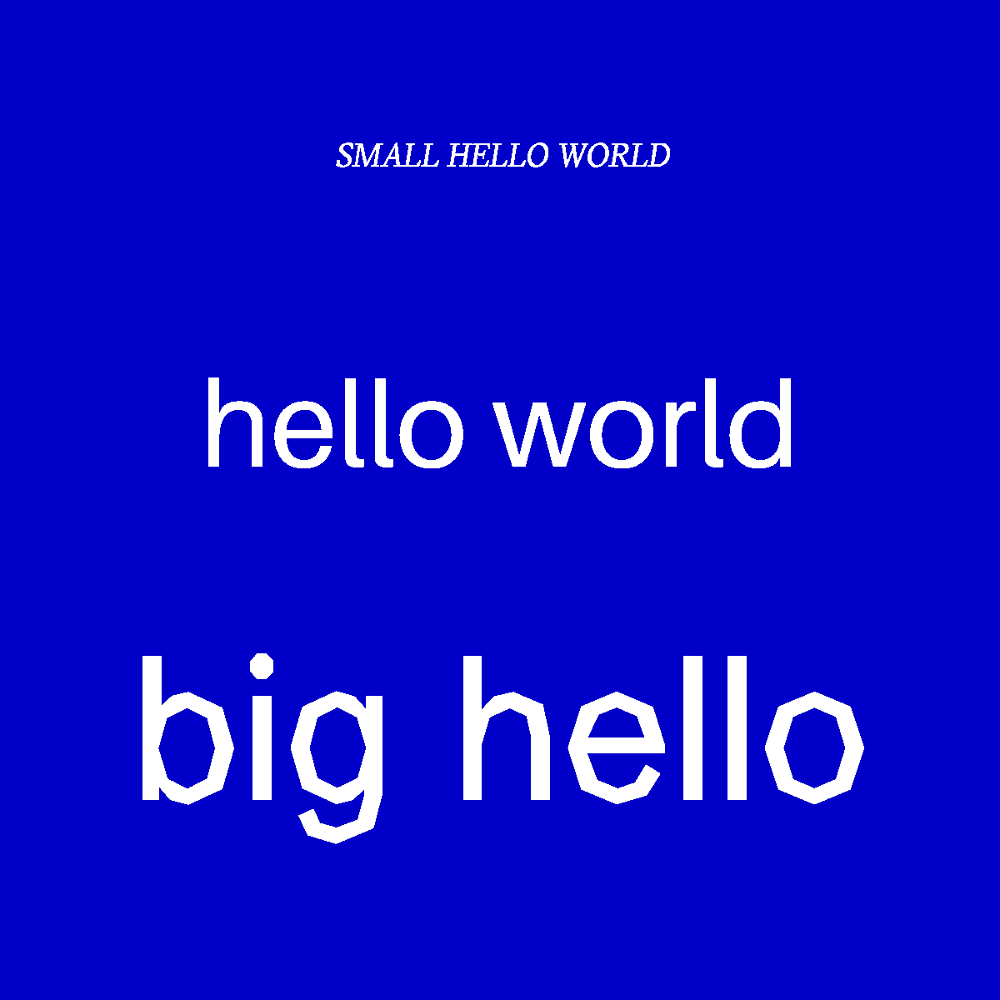

# Week 4 — Text in Processing & Finishing our HoL video

In this live coding session we put the words in code+words! After doing some processing tutorials in my own time, it was exciting to be able to apply the exact same principles to text.

## Second Life —

Last week my group (Finn, Tayla, Taj and I) had a 3 hour session to record the different scenes in Second Life we had roughly planned out. However, soon after we realised that the screen recordings were pretty terrible (frame rate wise, as well as being very out of sync with our text-to-voice generator). We were a bit tempted to keep the tacky-ness of these clips, but also felt that it was too distracting combined with the other bizarre elements we incorporated. With Second Life's eerily realistic graphics, we knew the potential for an evocative, cinematic performance was there, and were determined to grasp it.

We decided to reshoot after a few days, after more thorough planning in our shared Google doc. We had a script each and had chosen specific characters from the [text-to-voice generator](https://tetyys.com/SAPI4/) we were using for each of the characters. We planned to shoot the scenes while playing the voices in real time, so the avatars could move their mouths in sync with the script, which we would later edit over the videos.

This worked very successfully! Reshooting was a great choice, in my opinion, especially as we became well-practiced with camera controls, environment settings, and locations offered in Second Life. It also pushed us to plan meticulously, with a script and chosen locations before we began shooting. It still took a while, and we did undergo some technical difficulties. It was so much fun, and Second Life is an inherently mind-boggling and highly amusing place. Other than filming, we also went virtual-clubbing together and got kicked out of a location together.

After this, we took a collaborative approach to editing. Each of us screen recorded certain sections of the video, and would edit it ourselves before compiling it together into one. This was super interesting as we had never seen the footage or perspective of the other group-members as they filmed, and had to wait for the compilation to see how the entire video turned out. it was amazing, and mostly hilarious, to watch the outcome. I was truly impressed.

## [WEEK 05](https://jackieliiu.github.io/CODEWORDS/Week05/)
