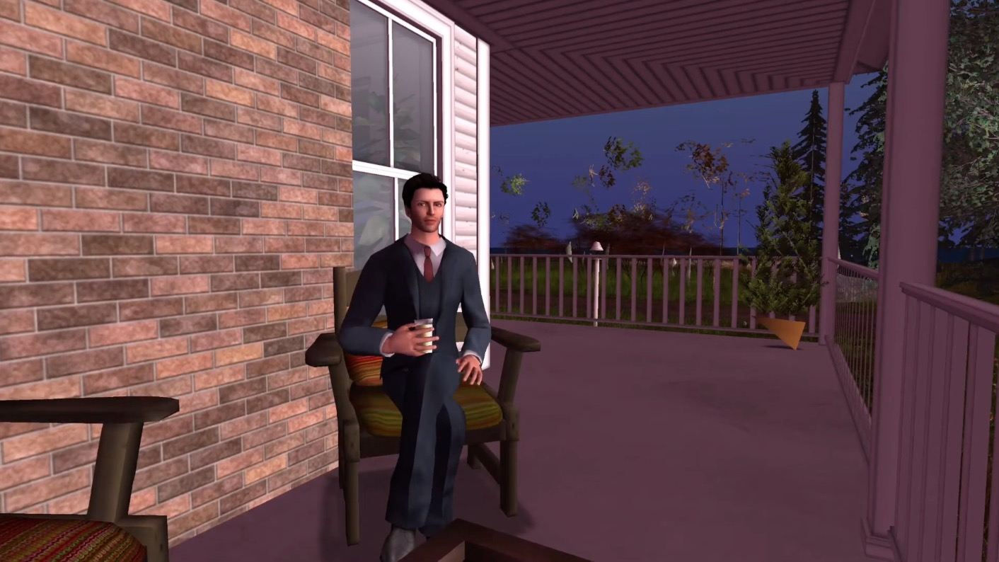
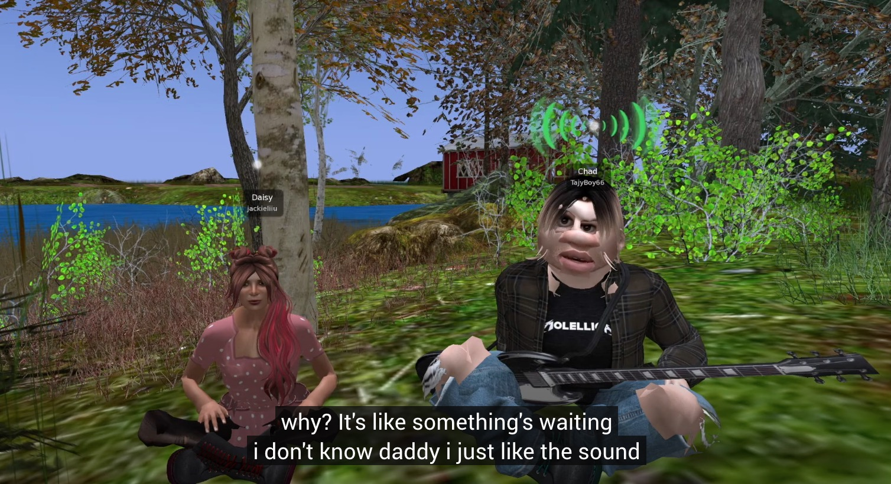
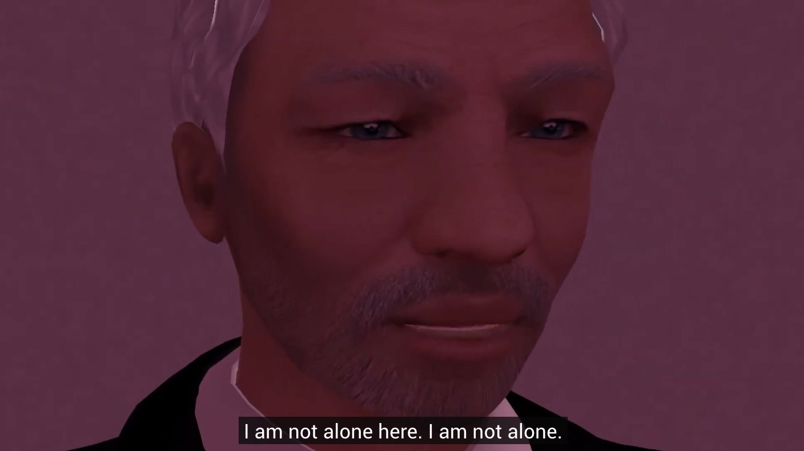
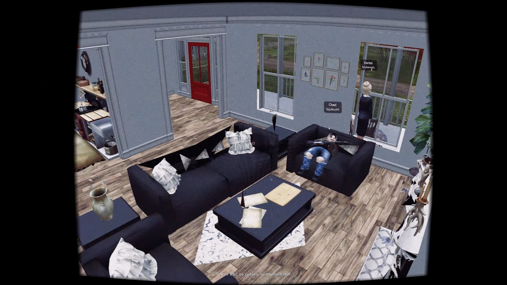
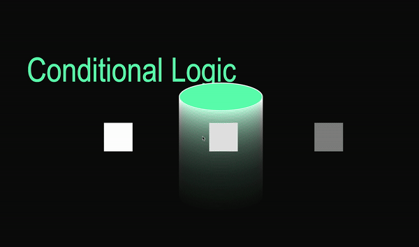
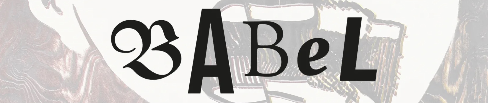
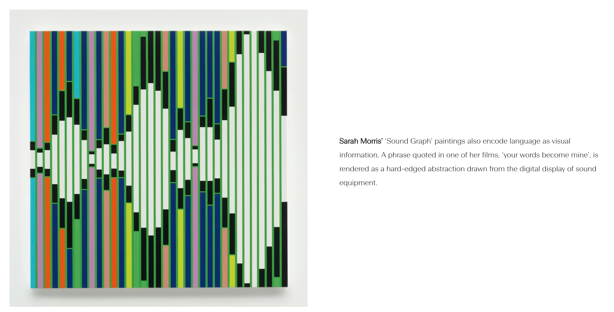
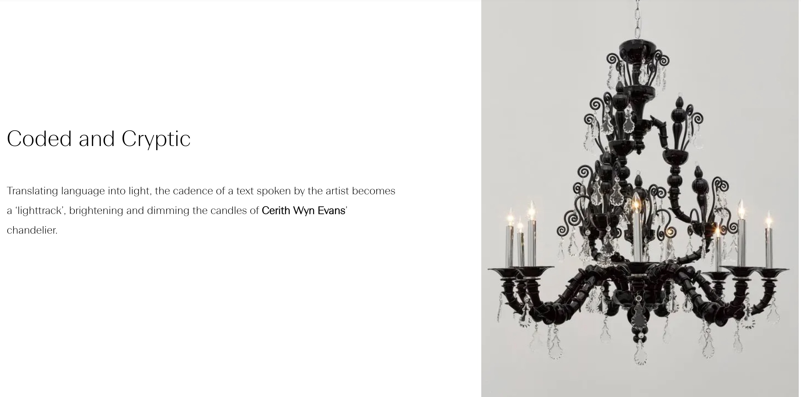

# Week 5 — Re-readings Presentations

**GROUP 2: CHAPTERS 1 & 2 IN SECOND LIFE:**

**[click here to watch :)](https://www.youtube.com/watch?v=KQGvEqaG5Ro&list=LLLFzmRL497_PQRJgcTARc3Q&index=8&t=0s) <<<<**

The videos from all the groups were chilling. I think I got actualy goosebumps while watching the Sims group, as well as the Club Penguin one. I did not expect such masterpieces to come out of this, but there's something so powerful about a text being re-interpreted in an unexpected form. I could see how groups worked around restriction, how creativity was evidently spurred by constraint. Really magical stuff.

### Reflection —

I didn't expect it, but I felt quite challenged by this project. I'll admit that at the beginning I was rather confused about the purpose of it all. What was I meant to learn? What was it teaching me? What should I be observing?

Later on, I began to read House of Leaves. I was genuinely gripped — not only by the storyline, but by the unconventional character of the book. It was nothing like I had ever read before. As I flipped through, I sensed the liveliness of the words that begged to come off the page, that in a freshly unsettling way, stimulates the brain to understand the essence of the story. *(I also decided that I really, really needed to see it in person, and would also love to have it physically, to read the entire book...so I bought it hahaa)*. I think at this point I was beginning to understand the affect of literature that breaks convention. How heightened could this affect be when placed in digital space?

I also reflected on the electronic literature we had researched, and drew connections between those and our project. What we were creating was in fact electronic literature, though it was something I had to keep making sense of in my head. It was difficult to explain to friends or family what I was learning in studio and what this project was, and I hope that in the future I'll be able to articulate e-lit in a way that does justice to how interesting and broad it actually is.

As for our re-reading, one of the most notable reflections I have is that our approach was wonderfully fluid and flexible. We kept our minds open to any strange alternative the platform of Second Life would throw at us, and we were willing to include glitches or imperfections. We acknowledged that retaining the authenticity of the game platform was just as important as telling the story.

I do think there was possibly space for more creative or abstract interpretations of the text. In a game platform that allowed us to almost literally depict what the words described, it was tempting to find the most accurate representation. I suppose at some points it felt as if we were only translating the text from print to game. The great thing about this is that we were able to witness how, naturally, the digital realm affected the text in an incredibly fascinating way that wasn't in our control.

Other than this, I think we did witness and create a rather haunting piece of e-literature. For me, the sound effects and incoherent text-to-voice narration were especially effective in creating the unbearable underlying dread. Though this scene is essentially the beginning of the narrative(s), I think we achieved a really strong anticipation, and a result that was reminiscent of the energetic and unpredictable quality of the original text.

### Conditional Logic in Processing —

I've been doing processing tutorials in my spare time and thoroughly enjoying it. I learnt about conditional logic and boolean variables, and so far have made this thing [here](https://jackieliiu.github.io/CODEWORDS/Week05/ConditionalLogic/conditionallogic).

### Babel —

Last semester Karen directed me to a White Cube online exhibition that I had to give my email to in order to access. Earlier in July they sent me an email about this new exhibition, called [*Babel*](https://whitecube.viewingrooms.com/viewing-room/40-babel/), which is all about language, communication and typography. I finally had a look at it this week! It includes a poetic quote from Penelope Lively: *"Language tethers us to the world. Without it, we spin like atoms."*

There were some incredible works there, and I was particularly pleased to find ones that used some kind of code. 

This flickering chandelier piece especially interests me, and gets me thinking about morse code. It's so exciting to think that language and words can still exist in a piece that is so purely object/image.
___

## [WEEK 04](https://jackieliiu.github.io/CODEWORDS/Week04/) | [WEEK 06](https://jackieliiu.github.io/CODEWORDS/Week06/)
