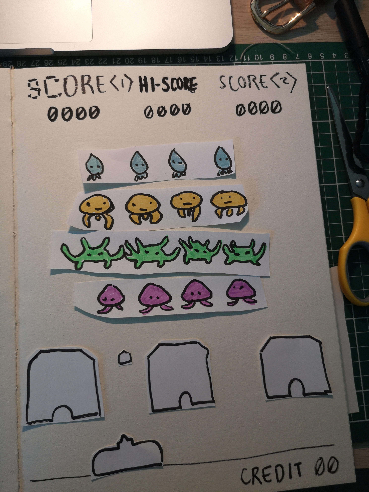

# Week 06 — Prototyping & Pseudocode

After choosing our readings, we began to think about how to approach designing our ideas and were introduced to Pseudocode.  behind how ideas would play out.

### Space Invaders —

The first activity we did in class involved making paper prototypes of vintage games. Firstly, this induced so much nostalgia! My group (Thomas, Peem and I) settled upon space invaders, a classic one that we thought would be rather straightforward and fun to prototype.

<p align="center"></p>

Making a rough prototype from paper helped me to understand the benefits of it. Not only was it helpful to myself to understand the game and its separate elements, but also to anyone who I was explaining the game to, to see, frame by frame, how the game works. It was also kind of thrilling to do something so physically with my hands again, as if I were in a real life tutorial :'( The time limit given made the process even more energetic — sometimes I really need that to make my brain kick in.

### Pseudocode —

According to Wikipedia, "Pseudocode is a plain language description of the steps in an algorithm or another system". We learn that it is meant to be human readable, a tool used to understand the intentions and conditions of an idea before actually figuring out how to code them.

For the mini exercise we did to try pseudocode, I chose the action of checking my messages.

```
START

  INPUT messages
  READ messages
  IF important THEN 
    reply
  ELSE IF medium important	THEN 
    think about it
  IF you have time	THEN 
    reply
  ELSE
	  forget

END IF

```

I found pseudocode ironically difiicult to write, but luckily it's not easy to get it wrong. I think I need to get more familiar with the statements I can make in pseudocode before I feel more comfortable writing it, but otherwise it seems to be a really great tool for the beginnings of understanding the logic and order

## What's Next for Text? —

Originally I had my eyes on Jean-François Lyotard's "The Postmodern Condition: A Report on Knowledge" as it raised some captivating theories of knowledge becoming obsolete in the future, and the commodity of knowledge. However, when I came across R.A Lanham's "What's Next for Text", I found that the last page especially piqued my interest, with a great quote from Jean Tinguely. Following this, he speaks of the economics of attention, that leads to fads and fashions, writing of attention as a scarce commodity. I saw potential in this idea, with elements possibly fighting for attention

<p align="center"></p>


## Live Coding Sesh —

We started working with the 'random' function, arrays, as well as larger blocks of text.

[Here](https://jackieliiu.github.io/CODEWORDS/Week06/ClassCode/RandomLettersErasing) is the code I did in class

[Here](https://jackieliiu.github.io/CODEWORDS/Week06/remixedcode/LettersandDots/) is a remixed version I did later incorporating randomly appearing dots.

and lastly,

[Here](https://jackieliiu.github.io/CODEWORDS/Week06/springparag/springparag/) is the springy paragraph we did in class that excites me very much. Sin waves!!?

## [WEEK 06 (and a half)](https://jackieliiu.github.io/CODEWORDS/Week06andahalf/)
