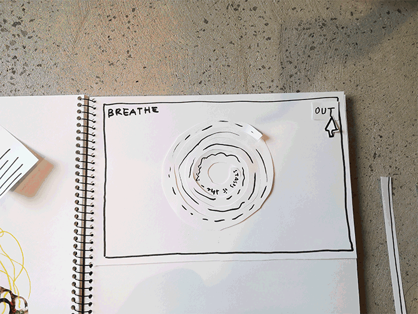
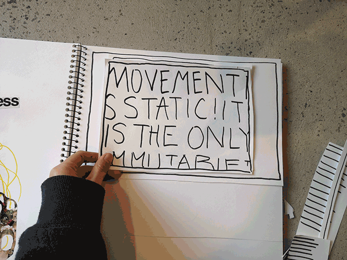
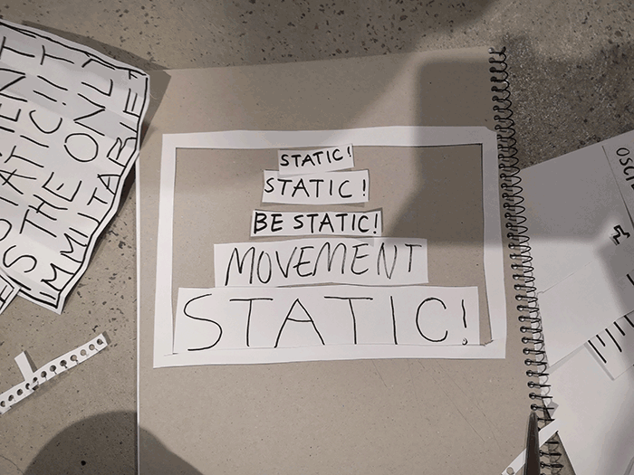

# Week 06 — Prototyping Space invaders

After choosing our readings, we began to think about how to approach designing our ideas and were introduced to Pseudocode.

## What's Next for Text?

Originally I had my eyes on Jean-François Lyotard's "The Postmodern Condition: A Report on Knowledge" as it raised some captivating theories of knowledge becoming obsolete in the future, and the commodity of knowledge. However, when I came across R.A Lanham's "What's Next for Text", I found that the last page especially piqued my interest, with a great quote from Jean Tinguely. Following this, he speaks of the economics of attention, that leads to fads and fashions, writing of attention as a scarce commodity. I saw potential in this idea, with elements possibly fighting for attention

# MID-SEM BREAK

I took some time to go through the entire reading to grasp the wider concepts that Lanham presented, and what he generally thought was next for text. Here are some notes I took, including some quotes (highlighted are concepts that I felt I could draw ideas from):

## More Prototypes

