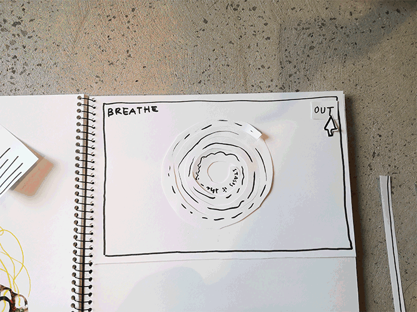
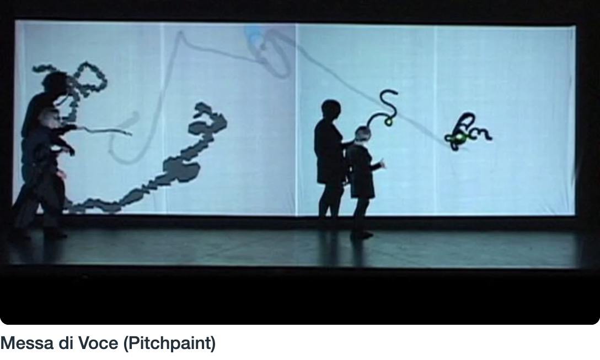

# Midsem Break

I took some time to go through the entire reading to grasp the wider concepts that Lanham presented, and what he generally thought was next for text. Here are some notes I took, including some quotes (highlighted are concepts that I felt I could draw ideas from):


## More Prototypes
<p align ="center"> </p>

## PSEUDOCODE
```
START

  SET spiralSize = 0
  INPUT spiral sentence
  
  IF user presses "in" THEN
    INCREMENT spiralSize
    
  IF spiralSize > 800 THEN
    stop INCREMENT
    PRINT "Press "out" to exhale"
    
  IF user presses "out" THEN
    DECREMENT spiralSize
    
  IF spiralSize < 500 THEN
    shatter spiral
    
  IF spiralSize = 0 THEN
    INPUT new spiral sentence
    
  ENDIF
      
LOOP
      
```

<p align="center"></p>

## PSEUDOCODE

```

START

INPUT textScreen
SET screenSize

FOR every second
  INCREMENT screenSize
  
IF screenSize/2 > window Width
  slide down off screen
  
ENDIF

INPUT new textScreen

LOOP


```
<p align="center"></p>

## PSEUDOCODE

```
START

INPUT Word String
SET WordSize
WHILE mouseIsMoving
  BUMP WordSize of random Word
ENDWHILE

      
```
<p align="center"></p>

## PSEUDOCODE

```
START 

  IF mouseX > windowWidth/2 THEN
    right half slides left
    
  ELSE IF mouseX < windowWidth/2 THEN
    left half slides right    
    
  ENDIF
  
  IF mouseIsPressed THEN
    INPUT new sentences
    
  ENDIF

      
```

## Zach Lieberman

I found Zach Lieberman through WeTransfer, funnily enough. His [Colorpush](https://colorpush.wetransfer.com/) collaboration with them was an incredible example of interactive code, and really gorgeous to watch. I loved the concept of pushing and mixing colours with your face and body, getting physically involved in digital creation.

Zach Lieberman is n American new media artist, programmer, designer and educator. He helped to create the School for Poetic Computation, and continues to label his practice as poetic computation. This is a wonderfully resonant way to describe what I feel I'm learning in this studio. Watching his [AIGA talk](https://youtu.be/bmztlO9_Wvo) about Poetic Computation introduced me to significant people in the early days of this field, such as Vera Molnar and Muriel Cooper. Zach's motto of 'always be iterating' particularly stuck with me. It's interesting the pressure we feel to finish things, complete projects. Everything we're making often feels like they must have a final state. The idea of continuing to iterate and let something grow, change and adapt as if it were an organism is quite foreign to me, and in such a way that it's liberating.

The more I learn about creative code, the more I want to deep-dive into it. It's an attractively refreshing field that almost detaches itself from the pomp and circumstance that the graphic design field often exudes, and there's something about this community that's just so... warm? I don't know, am I romanticising it? Sorry, I'm a bit off topic now. TLDR; I really want to keep coding.

The works I found from his projects with Golan Levin as [Tmema](https://vimeo.com/tmema) were really inspiring. They created installations/performance works that are responsive to movement and sound. In the work "Messa di Voce" they use this to tell a narrative:



I find 'Pitch Paint' an especially captivating scene, as the performers use their voices to control the direction, speed and size of a painting blob. Both of them have their own blob, and it feels as if they're dancing together with their voices.

___

### [<< WEEK 06](https://jackieliiu.github.io/CODEWORDS/Week05/) | [WEEK 07 >>](https://jackieliiu.github.io/CODEWORDS/Week07/)
