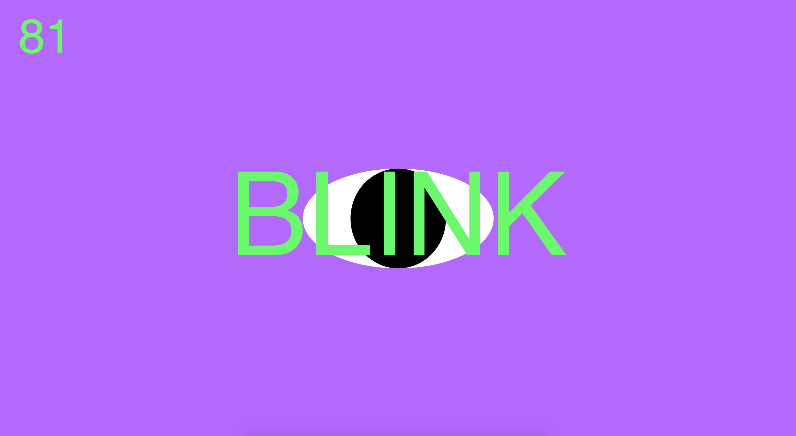

# Week 7 — Prototypes and Sound in Processing

We started off making sure that we all had excepts from our chosen readings. These are the ones I'm trying to choose from:

> Static, static, static! Be static! Be static! Movement is static! Movement is static! Movement is static because it is the only immutable thing—the only certainty, the only unchangeable. — Jean Tinguely

> We cannot exist, after all, only by breathing out abstraction, alphabets which do not think; nor only by breathing in animation, alphabets which do; but only by respiration, the life-giving oscillation of the two. That oscillation is what’s next for text.

> When the scarce commodity is not stuff, however, but the attention we bestow on it, then change is not the special case of stasis but vice versa. Stasis is the printout, the snapshot; change is the underlying reality, the enduring code.

## Working with p5.sound !

Our live coding session with Karen introduced us to using the sound library that comes with Processing. This was so helpful as I love the idea of incorporating sound or music into code. I'd love to use some little sound effects in my major project.

[Click here](https://jackieliiu.github.io/CODEWORDS/Week07/EyeBlink/BlinkEyeSound) for the eye blink I made in class.



## Prototype

I found it difficult to visualise everything that I envisioned on a paper prototype, but I managed something! I found the tactility of doing prototypes helpful for me to explore various possibilities for the text that I originally wouldn't have thought of. Eventually I decided that I want the user's oscillation from side to side to triger a new line of text to appear in a scrolling manner, over the live-video of the user. The text would automatically be in a state of jittering slightly, but when the mouse hovers over it, it will stop and be highlighted a different colour. If clicked, the text will either fly off the screen rotating in a 3D space, or it will jitter and drift randomly off the screen.

<p align="CENTER"></p>

### PSEUDOCODE

```
START

  DISPLAY Live Video
  DISPLAY "<- OSCILLATE ->"
  SET driftSpeed = 0
  SET sensorLeft = (x,y,w,h);
  SET sensorRight = (x,y,w,h);
  
  IF user moves over sensorLeft || sensorRight THEN
    INPUT new line of text
    CLEAR "<- OSCILLATE ->"
    
  IF mouse over any word THEN
    STOP word jitter
    highlight word colour
    
  ELSE jitter words 
    
  ENDIF
  
  SET animations [ jitterdrift, 3Dflyaway ]
  
  FUNCTION mousePressed () {
    IF on words THEN
      words (random[animations])
      driftSpeed += 1,
    ENDIF
  }
  
  
END
  
```

I am really unsure about this Pseudocode but ah well...


## CHRISTIAN BÖK — Xenotext

I attended a [Zoom Webinar](https://art-museum.unimelb.edu.au/events/webinar/?fbclid=IwAR0ubpbC54M0rQpwEy14uwfK_NH3PjswAS_OUtY8hQ0_xu6sh9Ck1Oiyzb0) by the Ian Potter Museum Gallery right after my Wednesday class, and just caught Christian Bök's live reading of an excerpt of his book *Xenotext*.

Christian Bök is a Canadian experimental poet, and a lecturer at Melbourne University. The project of his that fascinates me is *Xenotext*, one that he is on the verge of finishing. He proposes to engineer the first example of 'Living Poetry'. This involves translating a written poem through encipherment into a sequence of genetic nucleotides. The gene was built in a lab, and implanted into a bacterium. This bacterium has then become the living embodiment of the poem, and can, in turn, read and respond to the original text, generating a protein that can be translated back into an entirely new poem. He explains it quite well [here.]( https://www.youtube.com/watch?v=P-ipaiZDYHM)

This truly revealed to me what multitudinous possibilities there are for the forms of which literature can take. Not only is there poetic computation (as termed by Zach Lieberman), but also poetic bacteria, living poetry. Perhaps there is already poetry within our environments, which only need encipherment to be understood by us.

In "What's Next For Text?", Lanham argues that text has always *wanted* to animate, because it always *has*, that it is *returning* to 3D space rather than entering a new dimension. Perhaps in engineering a poetic bacterium, we are returning poetry to the world, to its living state.

## Remix for next class

Click [here](https://jackieliiu.github.io/CODEWORDS/Week07/newremix/MultipleBlinkEyes) to see the slightly iterated (and more creepy) version! I really would like to properly understand classes to be able to repeat objects without copy pasting all the time. I've done a tutorial but still really need practice to understand how to use it correctly, and remember all the syntax.


