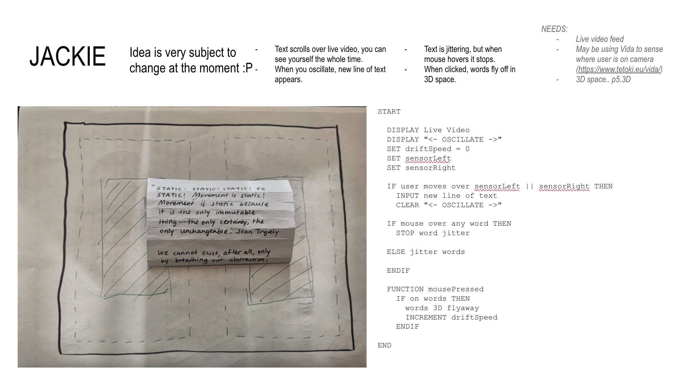
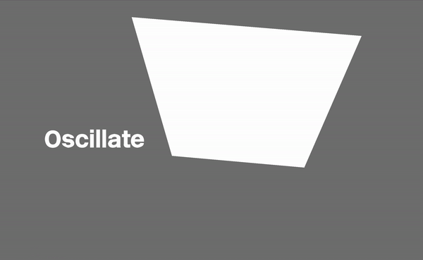
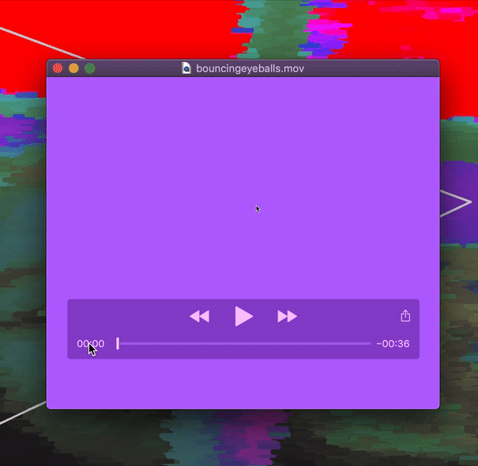
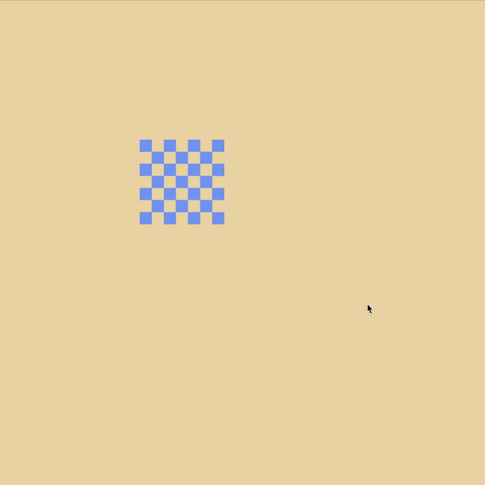
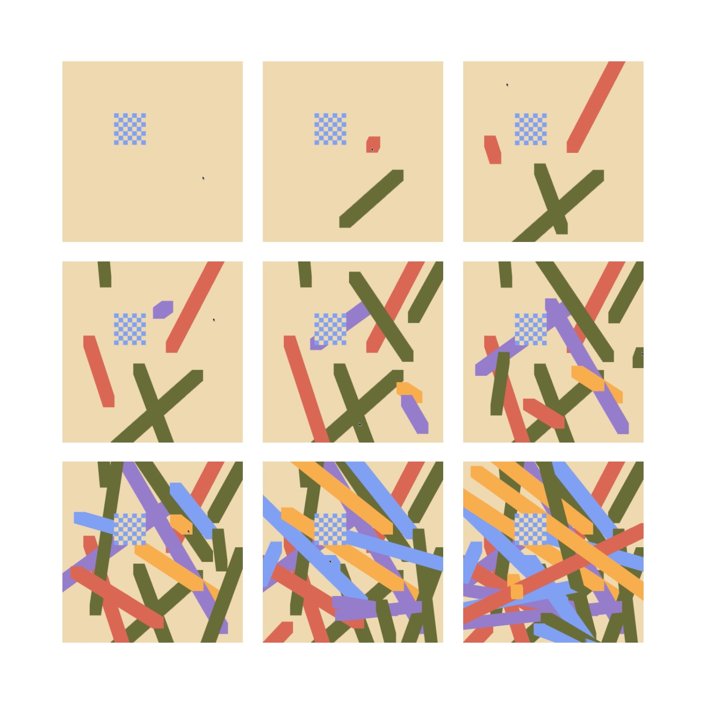

# WEEK 08 — PROTOTYPES, PSEUDOCODE + PROCESSING

In Week 8's tutorial, we looked through everyone's animated gifs paired with an attempted pseudocode, and we began to identify exactly what we needed. There are many things I have no idea how to do, but I look forward to learning them. I think the first step for now is learning to trigger SOMETHING to happen through  the reader's oscillation.

## POSENET: POSE RECOGNITION

I began to look at posenet, a function of ML5, the machine learning library. For some reason it took me a long time to figure out how to reference the library (as a simple HTML tag didn't seem to work), but I managed to create a library file to reference, which ended up working. It took me so much longer than I anticipated to achieve this yellow nose :')

From here, the position of the yellow dot can provide an easy way to detect which side of the screen the reader is on. Next, I'll try to make something happen when the yellow dot crosses the halfway X position.

## MURIEL COOPER: INFORMATION LANDSCAPES
I learned of Muriel Cooper earlier this semester (though I feel I should have known of her long, long ago), and watched [this video](https://youtu.be/BhrZHkdc2rU) of her Ted5 Talk in 1994, posted by MIT Media Lab. In this talk, Muriel talks through the work that she, her colleagues and students had produced. The work, from a 2020 lens, looks primitive - yet, these ways of presenting information were unseen in 1994. Muriel was a pioneer for these courageous ways of thinking, thinking with typography off the page, off the plane, into 3D space.

Her work is incredibly dynamic, experimental, visceral and *new*. In this particular presentation, the viewer flies through an infinite space with glowing planes of text, spinning and zooming through some kind of universe, no particular order of reading, no clear hierarchy. This was at the forefront of technology, able to be applied in various spaces - weather TV, aviation, any kind of data visualisation. Even through the fuzzy camera, I could feel the audience in awe of this thrilling visual experience. Muriel knew the potential of bringing type into a 3D space. This makes me remember R.A Lanham's words in my chosen reading. He says that we were born in 3D, and we feel intuitively home nowhere else.

## THE SOCIAL DILEMMA: NETFLIX FILM

The social dilemma is a new Netflix film by Sundance. It brought forward incredibly necessary and terrifying issues of the giant social media platforms we all use today. One of the key concepts mentioned near the beginning of the film is the economics of attention. You are not the customer - the advertisers are the customer. You are being sold.

This strongly echoes a key conccept in my reading, "What's next for Text?", that presses the fact that the scarce commodity of today is *attention*. The secret agendas of every giant social media platform was magnified by this film as the puppetmaster behind the disastrous issues of today. It's terrifying, in the sense of being at the mercy of a freely legal drug, and also dreadful, knowing that it's so difficult to escape (especially in lockdown).

## GRAPHIC MEANS : THE HISTORY OF TYPOGRAPHY

My sister and I sat down last night to watch Graphic Means. It walked us through the processes of cold typesetting, as well as the historical milestones of the developments of typography. One part that especially piqued my interest was the punch-hole code 

## TRYING 3D GEOMETRY IN WEBGL

a whole new world!!

### OTHER PROCESSING EXPERIMENTS

Slight iteration from last week's eye stuff. Bouncy!

[Try it here!](https://jackieliiu.github.io/CODEWORDS/Week08/bouncyeyes/bouncingeyes/)

  

some square painting using sprites through p5.play library. Also learnt how to load an image into processing.

 

