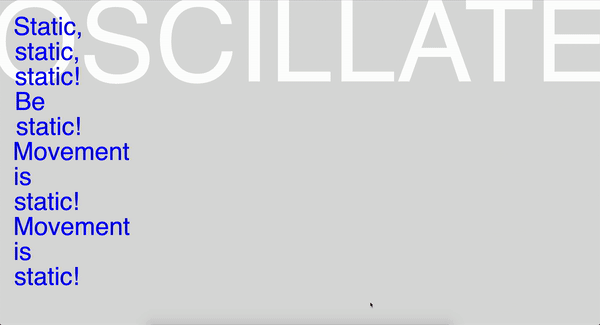

[click here to see a pose net test!](https://jackieliiu.github.io/CODEWORDS/Week09/PoseNet101/)

I tried to trigger the "hello" to appear with the x position of the nose ( pose.nose.x ) but when I tried to do it was blank. 
For now I'm just using mouseX. 

I really want achieve getting text to appear every time the person on camera moves from side to side.

**UPDATE:FIXED!**

I was able to fix it by using a nested if statement to make sure a pose was detected before trying to detect the nose.x position!!! I found a more helpful error message in the console log that pointed that out for me.

[click here for some progress(?)](https://jackieliiu.github.io/CODEWORDS/Week09/PoseNet102/PoseNet102/)

I ended up doing this weird thing when I properly split the string of text I put in. 

I'm having a lot of trouble trying to cycle through the words of the array. I like the idea of getting a different singular word every time you oscillate, but I can't seem to find out how to get the words to cycle to the next word in the array. I feel like this should be easy... AhhhhhhhhhhhH!!

I also would like to know how to do the same thing but have one word added a line underneath each time the reader oscillates, which the example above can be a vague representation of.

[Click here to try](https://jackieliiu.github.io/CODEWORDS/Week09/Test3/flyingwebcam/)

I decided to step away from trying to cycle through the words in my array to focus on other areas first.

I managed to center the video, in the way it's pictured in my prototype. However, I played with mapping the video's position to the X & Y positions of the nose. This made me laugh a lot. This gif shows my sister and I having fun flying around the screen.

I also made two separate strings of text so it feels more like reading whilst oscillating.

I also tried to do time-revealed text in the center. I split the string with commas rather than spaces, achieving a kind of line-by-line reading. This is in the latest version which isn't pictured in the gif, you can see it if you try it yourself!

## Next Steps—

These are some ideas of what I may want to experiment with:

- making words/lines of text seperately clickable, triggering them to oscillate off screen
- choosing suitable typeface/s and colours.
- trying to put this into WebGL space, possibly making the video on the surfaces of a 3D object, or just making the text fly off in a 3D manner. (I do like the 2D currently, but I really want to hint towards Lanham's belief that text is returning to 3D space through electronic literature).

## [WEEK 10](https://jackieliiu.github.io/CODEWORDS/Week10/)

