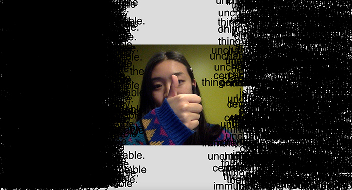
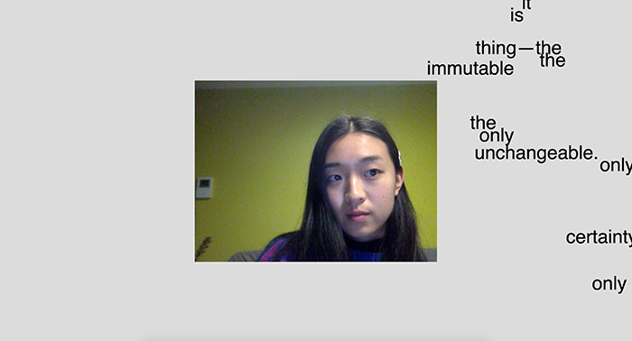

# WEEK 10 — PRESENTATIONS, TYPOGRAPHY AND NEXT STEPS

Have been trying to figure out how to get one word to appear at a time each oscillation. Been doing this for a week, not sure why I'm taking so long because I think this should have a simple solution!

I stripped the whole sketch back so I could focus on this one goal.

I added a class, and pushed them from an array according to the X position of the nose, so I think that's a step in the right direction. They do appear one at a time! However, they appear very quickly and keep looping...

SO! I need to find out how to make the loop only happen once each time. I tried using a boolean variable, but that resulted in only the first word appearing. I also tried noLoop(); but this freezes the entire draw function.

[Try Here](https://jackieliiu.github.io/CODEWORDS/Week10/OscillatingWords_Class/)

Other things I changed:

- I enforced the video size so it would be the same for everyone's devices.
- Made some more elements responsive to the window size.
- Added windowResize function to auto-resize when the window size is changed.

[Try Here](https://jackieliiu.github.io/CODEWORDS/Week10/OneAtATime/)

