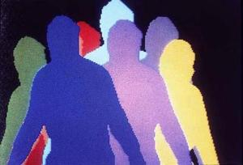
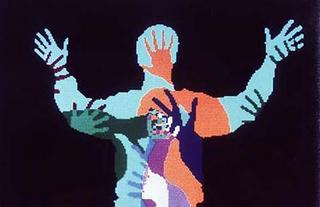
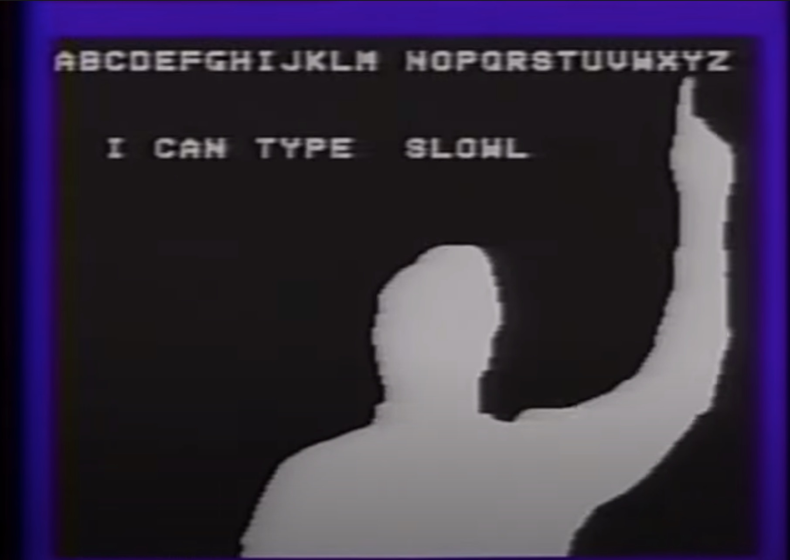
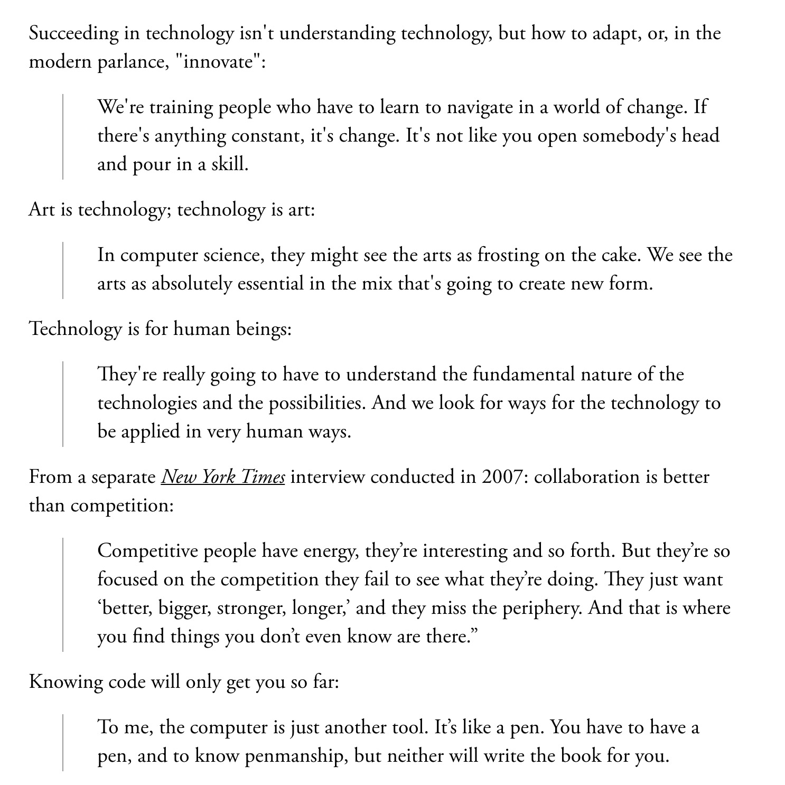

# WEEK 10 — WIP PRESENTATIONS, TRIALS & ERRORS

This week we presented where we were up to with our code. [This is mine](https://jackieliiu.github.io/CODEWORDS/Week09/Test3/flyingwebcam/). 

When Karen used it, I realised that her camera size/resolution was much larger than the standard 640 x 480, so I'd have to enforce that size in the code incase others have different sizes too. That was a great reminder for me to consider different settings people may have on their devices. I needed to clean up the consistency of my code, and also figure out how to reveal one word with every side-to-side oscillation. Other than that, I'm really pleased with the progress made since last week!

### Working on it...

I've been trying to figure out how to get one word to appear at a time with each oscillation. Been doing this for a week, not sure why I'm taking so long because I think this should have a simple solution! I stripped the whole sketch back so I could focus on this one goal. I finally added a class (I was avoiding this because I'm scared of classes but I knew it was coming), and pushed them from an array according to the X position of the nose, so I think that's a step in the right direction. They do appear one at a time! However, they appear very quickly and keep looping...

SO! I need to find out how to make the loop only happen once each time. I tried using a boolean variable, but that resulted in only the first word appearing. I also tried noLoop(); but this freezes the entire draw function.

[Try Here](https://jackieliiu.github.io/CODEWORDS/Week10/OscillatingWords_Class/)

Other things I changed:

- I enforced the video size so it would be the same for everyone's devices.
- Made some more elements responsive to the window size.
- Added windowResize function to auto-resize when the window size is changed.

### Update

I got one full string to appear at the very start, but it won't continue...

[Try Here](https://jackieliiu.github.io/CODEWORDS/Week10/OneAtATime/)

### Myron Krueger — Early Interactivity

  

I found Myron Krueger this week through someone I follow sharing his work [*Videoplace (1985)*](https://www.youtube.com/watch?v=d4DUIeXSEpk) online. Myron Krueger is one of the first computer artists to create digital interactive works. He is said to be one of the first generation of researchers exploring artificial/virtual reality and augmented reality. I went on to watch a short interview with Krueger in [this video](https://www.youtube.com/watch?v=dmmxVA5xhuo) where he states:

> “I resented the fact that [the computer] was denying that I had a body of any kind, and that it wasn't perceptual, it was all sort of symbolic. [...] We just discovered there was this very natural desire for someone to identify with the image on the screen. Their image was them and they expected it to do things in the video world to do as much as it did in the physical world. It was as if evolution had prepared us for seeing ourselves on television screens combined with the computer."

This natural desire he speaks of is one I want to play with and combine with reading in my own work. Even from these old videos I can feel the enormous affect of digital interactivity. I want the user to have this same feeling of control over their own experience, yet at the same time, the loss of it when the letters themselves are  oscillating away, when the experience seems to have a mind of their own. 

### Red Burns — Godmother of Silicon Valley

In several of Dan Shiffman's videos, he mentioned Red Burns and the quote that "She knew that technology was a means to an end. And that end is people." I think this philosophy is one that the Interactive Telecommunications Program (ITP) school she founded was built around. It's an integral focus to the field of computer arts, and I'd argue it's essential to remember in any field requiring technology.

I read an [article about Red Burns](https://www.theatlantic.com/technology/archive/2013/08/pearls-wisdom-tech-world-red-burns-godmother-silicon-alley/311722/)] from the Atlantic in 2013. She's not only a historical leader in tech, but has also provided the world with some beautiful pieces of advice.

Funnily enough, she states an opinion that echoes Andy, saying that the computer is just a tool, like a pen. Except Andy was talking about Adobe :')

Thinking about technology in a way that considers the world and its needs is so crucial. We can get carried away with the glamour of it, but retaining that focus on becoming people rather than technicians is something we should really strive for.

___

### [<< WEEK 09](https://jackieliiu.github.io/CODEWORDS/Week09/) | [WEEK 11 >>](https://jackieliiu.github.io/CODEWORDS/Week11/)

