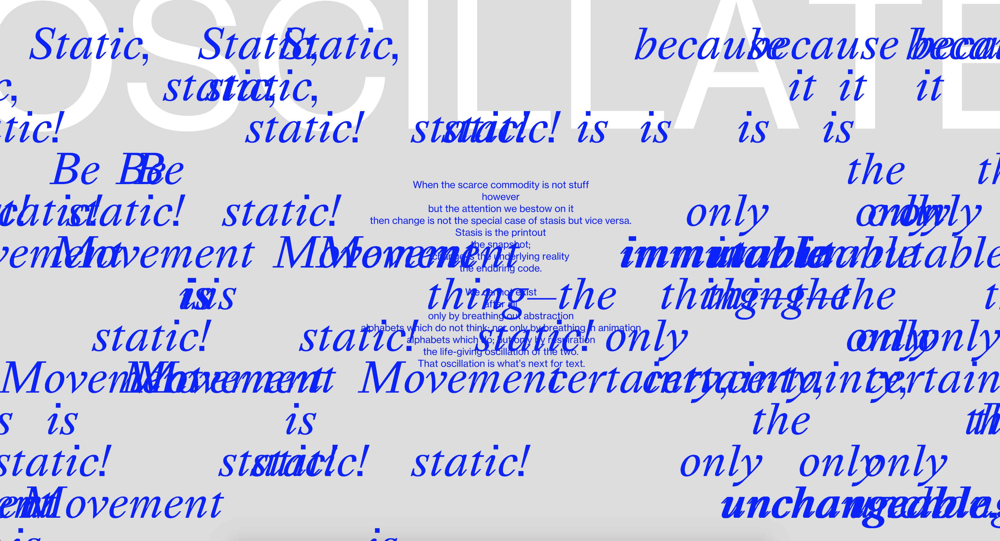
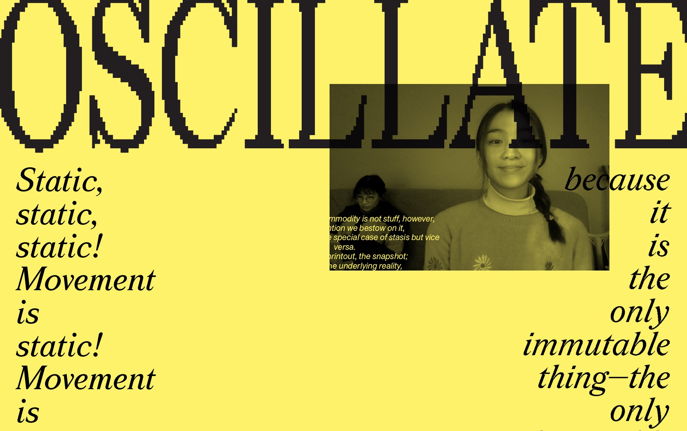
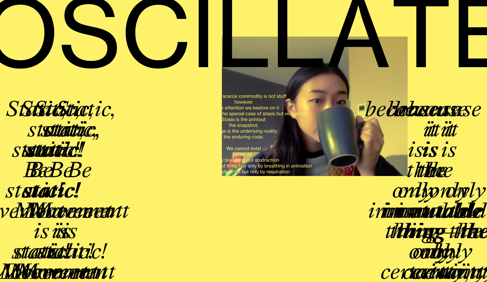
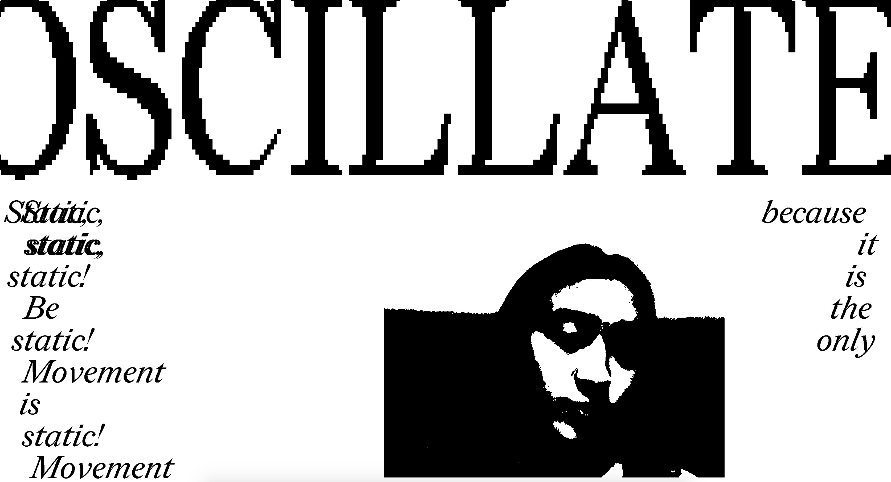
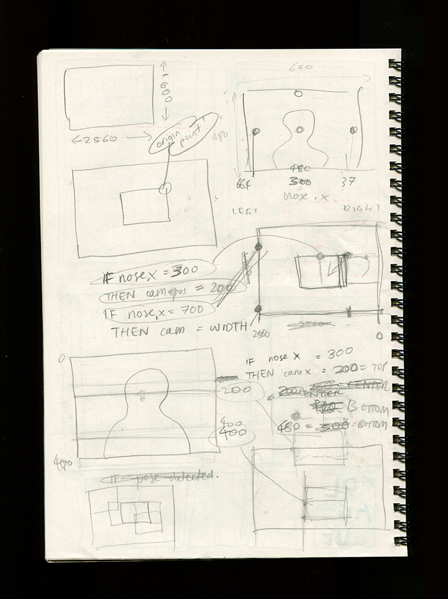
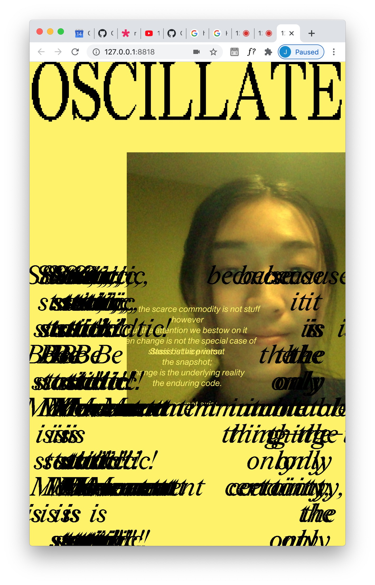

# WEEK 11 — ALMOST DONE!

### Code Progress

I finally managed to get these words appearing! After consulting with Karen about my problem, I realised I had to move most of my Posenet code into the gotPoses function. I also had to make 2 separate counting variables (wordcounter1, wordcounter2), as before I was using the same general [i] variable inside a loop, which Karen informed me I didn't really need. I made these counters go back to 0 when they were maxed out, so that the words would continue writing again and again.

This worked to get the words revealing with my oscillation. However it was still not exactly the experience I wanted, since I didn't want the entire reading experience to just be ONE oscillation of the reader's body, but a labour-intensive one in which the user *must* switch sides to get one new word. 

However, by making the sentences a bit longer through repetition and the words smaller, there were more words to reveal and more work to do. I thought the flying webcam was enough to get the user playing around with moving, so they would want to switch sides to reveal words anyway.

The experience is already achieving the affect I wanted it to, but I think I was just disappointed that I couldn't get that one thing working. Really quite satisfied with this outcome though.

I also found that when I left the screen on for a while and came back to it, the words had oscillated so far from their origin that it scattered across in a really beautiful way. It's weird that I had never spent enough time on my window for this to happen previously.

___

### Design

I didn't have a visual expectation for this idea when I had first made this prototype, so as I felt a little lost for direction, I decided that I'd make a mockup of what I wanted on illustrator first. 

The idea I settled upon is to pay homage to print, whilst also acknowledging its changing affect in a new digital environment. I'm planning on finding out a way to make the image black and white to go with that idea. I'm using a typeface called Redaction (https://www.redaction.us/), and the pixelised serif is one that I feel goes well with the theme of my reading, since it's almost like capturing the transition from print to digital. This is the mockup:

First Iteration of my code to build towards my mockup. Using the 'DARKEST' blending mode for the video, as the GRAY filter made the entire sketch black and white. I thought I could possibly fix this using createGraphics, but for some reason this didn't work either.

Trying out the THRESHOLD filter, and I kind of love this as it really reminds me of badly scanned readings. But I'm also a huge fan of the yellow page and think it's probably more visually stimulating.

## [NEW DESIGN!](https://jackieliiu.github.io/CODEWORDS/Week10/NewTypefaces_FlyingCam/)

___

### Making it Responsive

There was a lot in my code that was not responsive. I decided to make variables for everything that needed to be responsive and map them all to the window width, as that would be the main variable that would affect this sketch.

Another thing that I had hard-coded was the X & Y positions of the flying webcam. I had mapped the positions to the position of the detected nose, but to certain numbers that I had found worked. This was especially difficult to fix, as there had been translations and scalings to flip the video as well as center it. This meant I had to do a lot of maths to figure out the proper way to map these positions properly. I was able to FINALLY get it working in the end (however, when the window width is made smaller, it seems to veer off towards the right.) I definitely needed my sketchbook to make sense of this:

[Responsive Test 1](https://jackieliiu.github.io/CODEWORDS/Week11/ResponsiveTest/)

[Responsive Test 2](https://jackieliiu.github.io/CODEWORDS/Week11/ResponsiveTest_2/)

___

### [<< WEEK 10](https://jackieliiu.github.io/CODEWORDS/Week10/) | [WEEK 12 >>](https://jackieliiu.github.io/CODEWORDS/Week12/)
