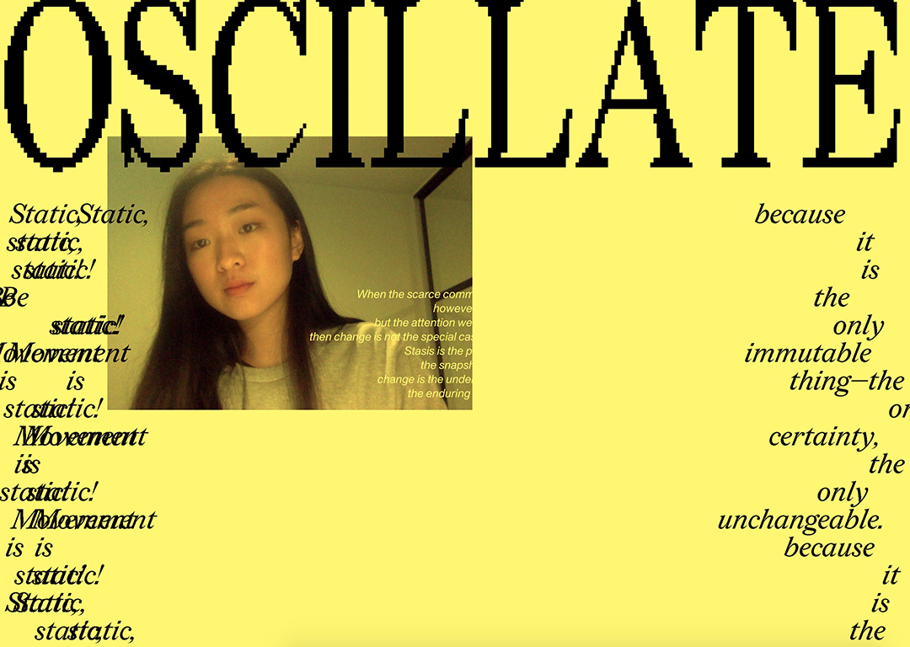

# WEEK 12 — THE SHOWCASE

[See the Final Work Here!](http://jackieliiu.github.io/CODEWORDS/Week12/OSCILLATE_Final/)

### Artist Statement

>When words move, they think. In R. A Lanham’s “What’s Next for Text”, we follow the changes that text has undergone throughout history, and imagine its future. ‘Thinking’, moving alphabets are described in this excerpt as what text has always striven to be, returning to the true underlying constant of change and movement.
> 
>‘OSCILLATE’ is an interactive reading experience that moves you, whilst you simultaneously move the experience. Your physical oscillation flings the camera across the screen, but more importantly, reveals the oscillating words. This work is informed and influenced by the interactive works of Myron Krueger and Zach Lieberman, as to offer that powerful participatory agency, whilst transforming it into an immersive reading experience. 
> 
>Using the ML5.js library inside Processing (made by Casey Reas & Ben Fry), I was able to use Posenet to access pose-tracking. The pose is mapped onto the video position, whilst also acting as a determinant for which side the words appear. To visualise the transition between print and digital, I’ve used the pixelated serif typeface Redaction by Titus Kaphar and Reginald Dwayne Betts.
>
>The body in collaboration with the text unlocks a wonderful co-existence and oscillation between physical and virtual spaces. That’s what’s next for text.
>
>Instructions: Please activate your webcam :)

___

### Au revoir!

This studio, with the guidance of Andy and Karen, has fostered a generous and genuinely supportive community of students. Even when online, it's funny how much I learnt from other students, with open sharing of code, asking for help and trying to help others. To see how much everyone has progressed in the span of a semester is unbelievable. I do hate to admit this, but it's easy to feel competitive or envious in other classes. The good news is, in this environment, I didn't feel a hint of that. Everyone was on a different trajectory, doing things that everyone else didn't know how to do, coming up with ideas that I audibly 'wow'ed at every time (my sister can testify to this).

It's an strange dissonance that I feel, as someone who is known mostly for illustration and graphic design. It's made me question what the label of 'illustration' really encompasses, and in what ways I can implement code into my practice. I don't want to feel torn between the two fields, but rather, synthesize them to create something interesting. On the other hand, code seems to complement graphic design perfectly, in a way that adds interactive or visual flair that distinguishes it from others. 

I'm really excited to bring to life other projects I have in mind. After working with Bowen Street Press for a few book designs, I have seedlings of ideas to work with writers in some way to show their work in a digital spaces, or perhaps make a electronic zine collaboration with other creative coders!

Thanks so much for the best studio ever, and see you guys later! :)

___
